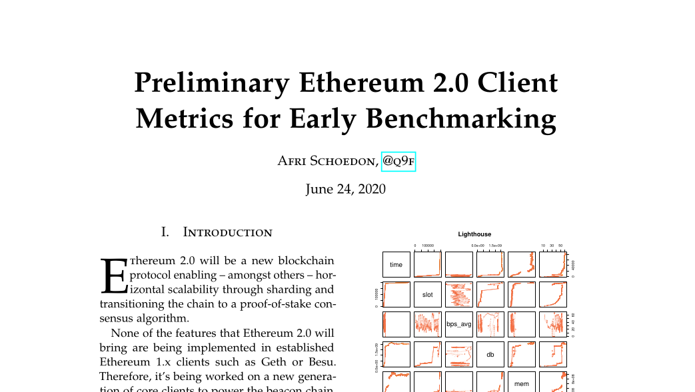

# Multi-client benchmark on Witti testnet 2020/06/22
Preliminary, high-level ETH2-client benchmarks.
- [x] Lighthouse
- [x] Prysm
- [x] Teku

Report: [./res/2020-06-eth2-bench.pdf](./res/2020-06-eth2-bench.pdf) (PDF), raw data: [./dat](./dat) (CSV), client logs: [./log](./log) (LOG).

### Host systems (3x)
- VPS: Scaleway DEV1-XL _(*)_
- OS: Arch Linux, kernel 5.7.2-arch1-1
- CPU: AMD EPYC 7281, 4 vCPUs
- RAM: 12 GB
- Disk: 120GB NVMe

_*) Note, this is a preliminary, high-level benchmark that should be repeated in future on bare-metal machines after stable client-releases are available to eliminate potential performance invariances caused by virtualized systems._

### Lighthouse
- `lighthouse/0.1.2`
- `master` @ 710409c2bafbd118ac8a9a4115ed7a8abfe9929a
- Rust `1.44.1`, Cargo `1.44.1`
- Permalink: https://github.com/sigp/lighthouse/tree/710409c2bafbd118ac8a9a4115ed7a8abfe9929a

### Prysm
- `Prysm/Git commit: 172435374d07982a8f15b0ceb042b53ce284fa7e. Built at: 2020-06-22T10:55:28+02:00`
- `witti` @ 172435374d07982a8f15b0ceb042b53ce284fa7e
- Go 1.14.4, Bazel 3.2.0
- Permalink: https://github.com/prysmaticlabs/prysm/tree/172435374d07982a8f15b0ceb042b53ce284fa7e

### Teku
- `teku/v0.11.5-dev-3bd72680/linux-x86_64/-na-openjdk64bitservervm-java-14`
- `master` @ 3bd726809afe32296bc0b480168e380f66702354
- Java `14.0.1`, Gradle `6.5`
- Permalink: https://github.com/PegaSysEng/teku/tree/3bd726809afe32296bc0b480168e380f66702354

### Witti testnet
- Spec version: `v0.11.3`
- Circa `190_000` slots filled with circa 70% blocks at start time
- 3 different clients known to validate the network
- 5 different clients known to connect and sync the network
- Permalink: https://github.com/goerli/witti/tree/255cf1ab944ebad5a756116e81cd9079b65fae50

### Metrics collected
- `time`: Unix time in seconds
  - all: (Ruby) `Time.now.to_i`
- `db`: Database size in bytes
  - Lighthouse: (Shell) `du -bs $HOME/.lighthouse/beacon/chain_db/`
  - Prysm: (Shell) `du -bs $HOME/.eth2/beaconchaindata/`
  - Teku: (Shell) `du -bs $HOME/.local/share/teku/data/db/`
- `mem`: Resident memory in bytes
  - Lighthouse: (REST API) `/node/health`, `.pid_mem_resident_set_size`
  - Prysm: (Metrics) `process_resident_memory_bytes`
  - Teku: (Metrics) `process_resident_memory_bytes`
- `slot`: Head slot number in 1
  - Lighthouse: (REST API) `/beacon/head`, `.slot`
  - Prysm: (gRPC API) `/eth/v1alpha1/beacon/chainhead`, `.headSlot`
  - Teku: (REST API) `/beacon/head`, `.slot`
- `bps`: Slot sync each second in 1/second _(*)_
  - all: (Ruby) `(h.to_f - prev_h.to_f) / dt`
- `peers`: Peer count in 1
  - Lighthouse: (REST API) `/network/peer_count`
  - Prysm: (gRPC API) `/eth/v1alpha1/node/peers` _(counted)_
  - Teku: (REST API) `/network/peer_count`

_*) Note, due to different ways of processing incoming badges of blocks, this metric should be recomputed based on an average taken over 60 seconds._

### Metrics derived (TBD)
- Slot sync speed over time (moving average)
- Database size over sync time
- Database size over slot count (future projection: 1Y, 5Y)
- Resident memory usage over sync time
- Resident memory usage over time augmented with chain finality (external data)
